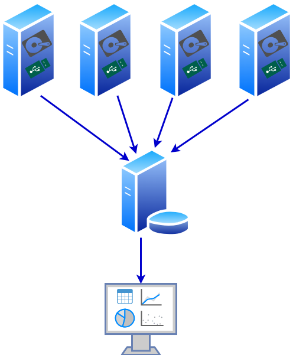
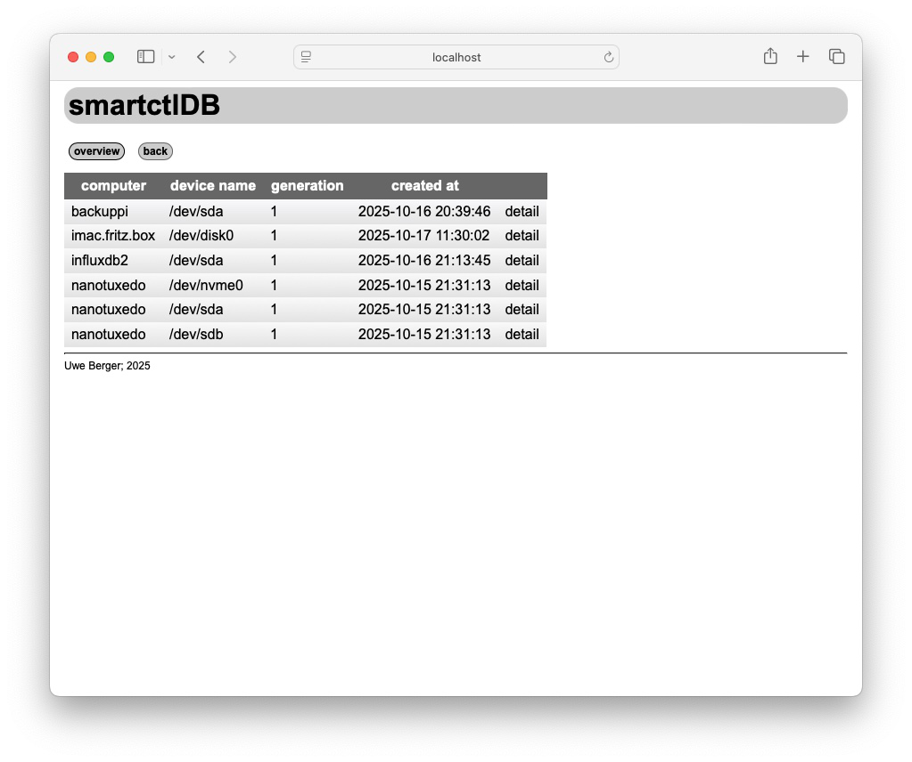
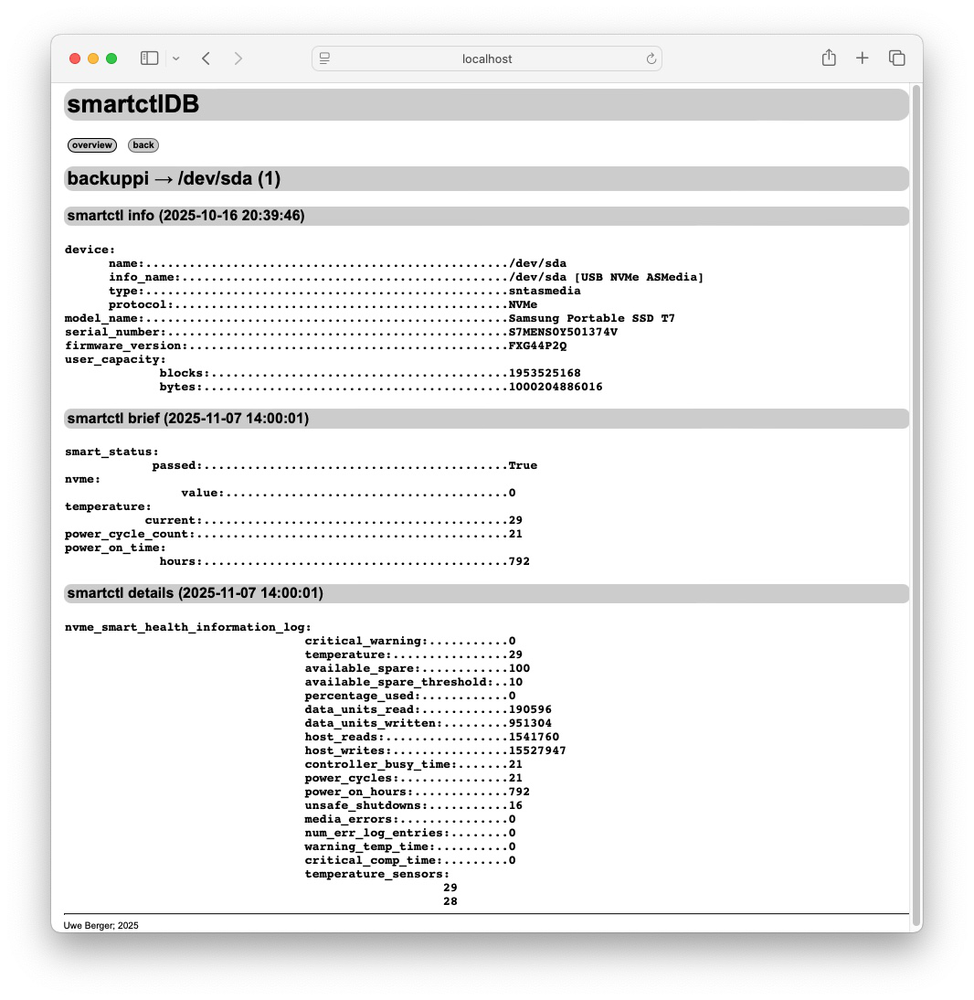
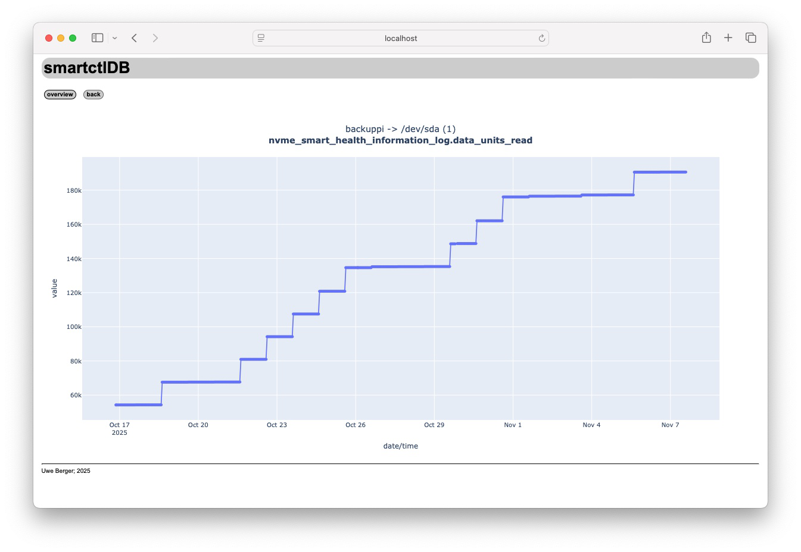

# smartctl_db

Die Idee ist es, diverse Informationen über die Festplatten verschiedener Computer im Netz zentral zu sammeln und auszuwerten:



Als Tool zum Sammeln der entsprechenden Informationen wird [smartctl](https://www.smartmontools.org/) verwendet, da es für alle gängigen Betriebssystem (zumindestens die, die ich verwende) verfügbar ist.

## smartctl_db.py

Auf jedem Rechner, dessen Festplatten in die zentrale Protokollierung aufgenommen werden sollen, wird zyklisch (z.B. als cron-Job) dieses Python-Script gestartet. Innerhalb dieses Scriptes wird [smartctl](https://www.smartmontools.org/), als externes Programm, aufgerufen, die Ausgaben ensprechend verarbeitet und in eine zentrale Datenbank abgespeichert. Die Parameter der zu prüfenden Festplatten werden dem Pythonscript beim Aufruf mittels einer Textdatei übergeben (also z.B.):
```
> smartctl_db.py drive_list
```
Eventuell muss das Script mit root-Rechten gestartet werden.

Der Inhalt der Parameterdatei könnte z.B. so aussehen: 

```
> cat drive_list
/dev/sda, nvme
/dev/sdb, auto
```
Wobei die erste Spalte dem Namen des Devices und die zweite Spalte dem Typ (siehe Option -d von smartctl) entspricht. Die Angaben sind vom Festplattentyp und Betriebssystem abhängig. Hilfreiches Tool zur Ermittlung der Parameter ist u.a. smartctl selbst (RTFM).

Da die [S.M.A.R.T.](https://de.wikipedia.org/wiki/Self-Monitoring,_Analysis_and_Reporting_Technology)-Informationen, in Abhängigkeit vom Festplattenhersteller und dem Festplattentyp (ATA, SCSI, NVME etc.), sehr stark variieren, wird smartctl mit der Option -j (JSON-Ausgabe) gestartet. Diese JSON-Ausgaben werden in eine einheitlich strukturierte SQL-Datenbank, welche auch JSON-Daten (z.B. [MariaDB](https://mariadb.com/resources/blog/using-json-in-mariadb/), [sqlite3](https://sqlite.org/json1.html)) aufnehmen/verarbeiten kann, abgelegt. 

Detailiertere Infomationen zu smartctl_db.py sind im Quellcode des Scriptes selbst zu finden.


## web_smartctl/web_smartctl.py

Hierbei handelt es sich um eine einfache Web-Applikation, basierend auf den Python-Web-Framework [web.py](https://webpy.org/), welche die in der Datenbank gesammelten smartctl-Informationen darstellt. Auch hier gilt, detailiertere Informationen sind im entsprechenden Quellcode zu finden.

### Startseite
Übersicht aller Festplatten, zu denen smartctl-Informationen gesammelt werden:



### Details
Die zeitlich letzten ermittelten smartctl-Informationen zu einer Festplatte:



Ausgewählte numerische Werte (entsprechender HTML-Link) können als Linien-Diagramm über den gesamten aufgenommen Zeitraum dargestellt werden.


### Diagramm
Linien-Diagramm zu einer, unter Details, ausgewählten Messreihe einer Festplatte:



Für die Generierung der Diagramme wurde die [Offline-Version](https://www.tutorialspoint.com/plotly/plotly_online_and_offline_plotting.htm) der Python-Bibliothek [plotly](https://plotly.com/python/) verwendet --> coole und einfache Technik, um "mal schnell" ein Diagramm zu einer Zahlenreihe für eine Webseite zu generieren...!


## ToDo

Es fehlt noch:
  - aussagekräftige Metriken automatisch nach Anomalien auswerten (z.B. beim Insert in die DB --> Trigger?)...
    - ...und ggf. auf Webseite geeignet darstellen
    - ...und vielleicht eine Mail o.ä. senden
  - zeitliche Eingrenzung Diagramm?
  - ein paar Hilfeseiten (Links, Hover, was auch immer) zu den Bedeutungen der Metriken


---
Uwe Berger; 2025


