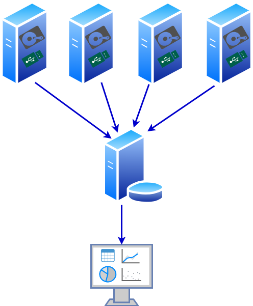

# smartctl_db

Die Idee ist es, diverse Informationen über die Festplatten verschiedener Computer im Netz zentral zu sammeln und auszuwerten:



Als Tool zum Sammeln der entsprechenden Informationen wird [smartctl](https://www.smartmontools.org/) verwendet, da es für alle gängigen Betriebssystem (zumindestens die, die ich verwende) verfügbar ist.

## smartctl.py

Auf jedem Rechner, dessen Festplatten in die zentrale Protokollierung aufgenommen werden sollen, wird zyklisch dieses Python-Script gestartet. Innerhalb dieses Scriptes wird [smartctl](https://www.smartmontools.org/), als externes Programm, aufgerufen, die Ausgaben ensprechend verarbeitet und in eine zentrale Datenbank abgespeichert. Die Parameter der zu prüfenden Festplatten werden, werden dem Pythonscript beim Aufruf mittels einer Textdatei übergeben (also z.B.):
```
> smartctl_db.py drive_list
```
Eventuell muss das Script mit root-Rechten gestartet werden.

Der Inhalt der Parameterdatei könnte z.B. so aussehen: 

```
> cat drive_list
/dev/sda, nvme
/dev/sdb, auto
```
Wobei die erste Spalte dem Namen des Devices und die zweite Spalte dem Typ (siehe Option -d von smartctl) entspricht. Die Angaben sind vom Festplattentyp und Betriebssystem abhängig. Hilfreiche Tools zur ermittlung der Parameter ist u.a. smartctl selbst (RTFM).

Da die s.m.a.r.t.-Informationen, in Abhängigkeit vom Festplattenhersteller und dem Festplattentyp (ATA, SCSI, NVME etc.), sehr stark variieren, wird smartctl mit der Option -j (JSON-Ausgabe) gestartet. Diese JSON-Ausgaben werden in eine einheitlich strukturierte SQL-Datenbank, welche auch JSON-Daten (z.B. [MariaDB](https://mariadb.com/resources/blog/using-json-in-mariadb/), [sqlite3](https://sqlite.org/json1.html)) verarbeiten kann, abgelegt. 

Detailiertere Infomationen zu smartctl_db.py sind im Quellcode des Scriptes selbst zu finden.

Die angedachten Auswertungen und Visualisierungen werden auf die hier gesammelten Daten aufsetzen. Dazu später mehr....

---
Uwe Berger; 2025


